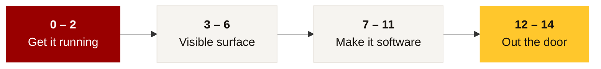

<div align="center">

# Streamlit, taught in Streamlit

**A self-teaching workshop for USC summer scholars.**

The tutorial *is* a Streamlit app — every concept is demonstrated live, next to the code that produced it.


[](https://your-app.streamlit.app)

</div>

---

## Run it

```bash
python3 -m venv .venv
source .venv/bin/activate
pip install -r requirements.txt
streamlit run app.py
```

Opens at `http://localhost:8501`.

## Deploy it

So students can read it before and after class.

1. Push the Streamlit project folder to a **public** GitHub repo.
2. Go to **[share.streamlit.io](https://share.streamlit.io)** → sign in with GitHub → **Create app**.
3. Repo, branch `main`, main file `app.py` → **Deploy**.
4. Share the resulting `*.streamlit.app` URL.

> [!NOTE]
> No secrets or data files needed — the sample data is generated in code.

---

## What's inside



<details open>
<summary><b>Act I · Get it running</b> &nbsp;—&nbsp; lessons 0–2</summary>

|  | Lesson | Covers |
|:--:|---|---|
| `00` | Framing | The 3-line app |
| `01` | Install | `venv`, `pip install`, `streamlit run`, auto-rerun, troubleshooting |
| `02` | **The rerun model** | ⭐ The mental model everything else depends on |

</details>

<details>
<summary><b>Act II · The visible surface</b> &nbsp;—&nbsp; lessons 3–6</summary>

|  | Lesson | Covers |
|:--:|---|---|
| `03` | Display | Text, status messages, metrics, dataframes, `st.data_editor` |
| `04` | Widgets | All the inputs, forms, and the button-doesn't-latch trap |
| `05` | Layout | Columns, tabs, expanders, sidebar, placeholders, progress |
| `06` | Charts | Built-ins, a filter→chart pattern, maps, other plotting libraries |

</details>

<details>
<summary><b>Act III · Make it software</b> &nbsp;—&nbsp; lessons 7–11</summary>

|  | Lesson | Covers |
|:--:|---|---|
| `07` | State | `st.session_state` — counter, echo, growing list, live inspector |
| `08` | Caching | `@st.cache_data` vs `@st.cache_resource`, with a timed demo |
| `09` | Files | Upload, download, media, the absolute-path deploy trap |
| `10` | Structure | `pages/` folder, `st.navigation`, shared modules, `config.toml` |
| `11` | Secrets | `secrets.toml`, `.gitignore`, Community Cloud secrets |

</details>

<details>
<summary><b>Act IV · Out the door</b> &nbsp;—&nbsp; lessons 12–14</summary>

|  | Lesson | Covers |
|:--:|---|---|
| `12` | Deploy | Pre-flight checklist, `requirements.txt`, git push, updating |
| `13` | Debug | Searchable troubleshooting list + debugging technique |
| `14` | **Build sheet** | Students answer 6 questions, download a generated `app.py` starter |
| `--` | Cheat sheet | Printable one-pager |

</details>

Progress checkpoints across all lessons are tracked in the sidebar.

---

## Suggested 2-hour session

| Time | Activity |
|:--:|---|
| `0:00` → `0:15` | **Lessons 0–1** together. Everyone gets `streamlit run` working before moving on. |
| `0:15` → `0:30` | **Lesson 2** at the front. Do not skip it. |
| `0:30` → `1:00` | **Lessons 3–6**, students working through demos on their own while you circulate. |
| `1:00` → `1:20` | **Lessons 7–9**. Session state is the second conceptual hurdle. |
| `1:20` → `1:35` | **Lesson 14 build sheet** — students plan their own app and download the starter. |
| `1:35` → `2:00` | **Lessons 11–12** live: everyone deploys. End with URLs posted in the class channel. |

> [!WARNING]
> Budget real time for the install step. It's where people get stranded, and nothing after it
> works until it's done.

> [!TIP]
> Most later confusion traces back to Lesson 2. Teach it from the front, out loud, with the
> broken counter on screen.

Lessons 10 and 13 work well as assigned reading.

---

<details>
<summary><b>How the demos work</b></summary>

<br>

`run_and_show()` renders each snippet with `exec()`, so the **Code** tab is guaranteed to be exactly
what produced the **Live result** tab — they can never drift apart.

> [!IMPORTANT]
> This is a teaching device, not a pattern to copy into student projects. Worth saying out loud
> if a sharp student asks.

</details>

<details>
<summary><b>Customizing for your course</b></summary>

<br>

- Swap `load_sample_data()` for a dataset from your syllabus so demos match their homework.
- Edit the rubric list at the bottom of Lesson 14 to match your actual grading criteria.
- The USC palette lives in the `CARDINAL` / `GOLD` constants near the top of `app.py`.

</details>

<div align="center">
<br>
<sub>Built with Streamlit · USC Summer Scholars</sub>
</div>